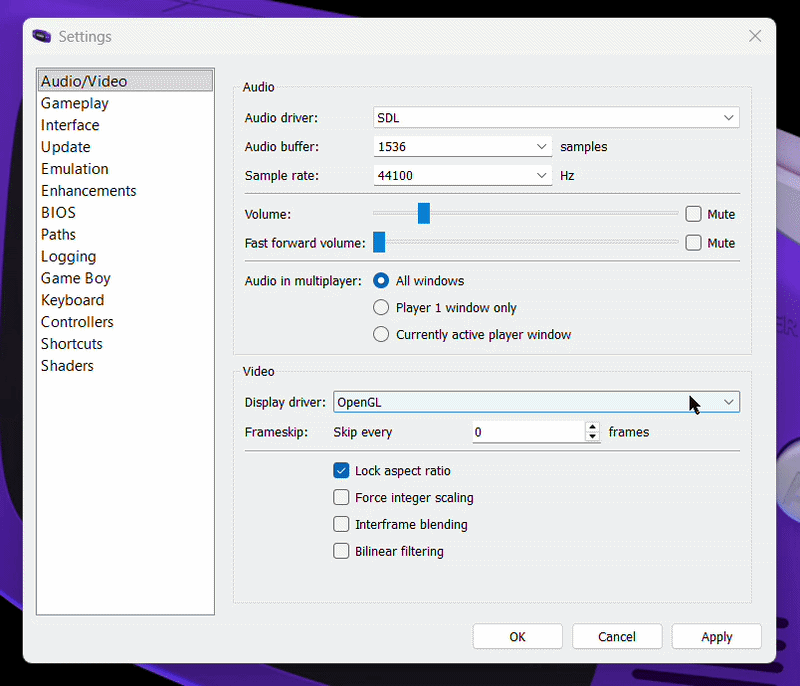
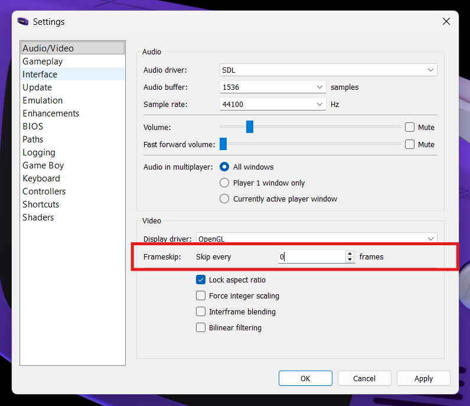
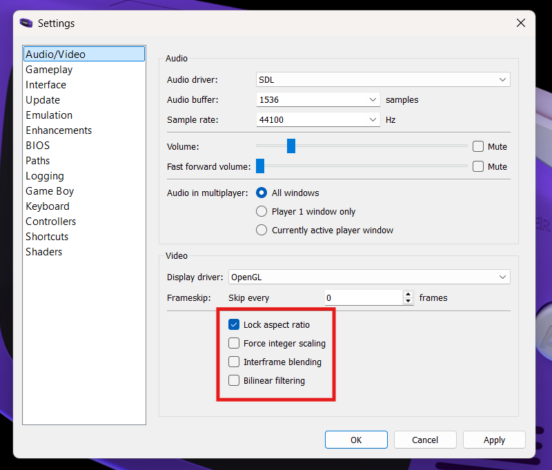
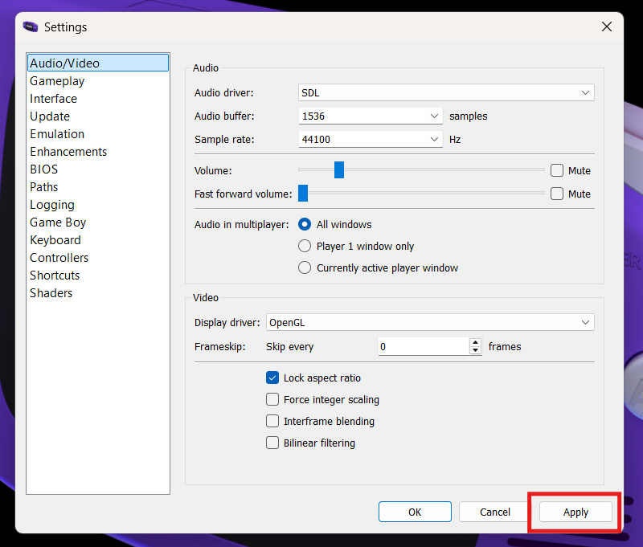

## Overview

The Audio / Video settings in mGBA will allow you to control your preferences as to how your games look and sound on your system. Because mGBA emulates older hardware on modern computers, these settings help ensure that the graphics display clearly, audio plays smoothly and gameplay runs at the correct speed.

!!! Check "Default Settings"

    Most systems will work with the default settings, but spending a few minutes reviewing these options can significantly improve overall performance and comfort.

## Audio / Video Settings

This section will be divided into two parts  (audio settings and video settings), but first we must navigate to the settings menu.

1. **Navigate** to the audio / video settings.
    
    > Tools > Settings > Audio/Video

    { width="90%" }

    { width="90%" }

### Audio Settings

2. **Choose** an audio driver.

    Affects audio compatibility, latency, and playback stability.

    { width="90%" }

    [**SDL**](https://www.libsdl.org/) is a widely used multimedia library designed for games and emulators. It communicates directly with the operating system’s audio system and is generally the most stable and compatible option.

    ??? Info "Reasons To Choose SDL"
        - Lower audio latency
        - Fewer audio glitches
        - Consistent performance
        - Often recommended

    [**Qt Multimedia**](https://doc.qt.io/qt-6/qtmultimedia-index.html) is part of the Qt framework used to build mGBA’s graphical interface. It integrates smoothly with the application but may not always perform as consistently as SDL on all systems.

    ??? Info "Reasons To Choose Qt Multimedia"
        - Works well with standard system audio settings
        - May resolve issues if SDL has compatibility problems
        - Simple and reliable fallback
        - No extra configuration

3. **Adjust** audio buffer.

    Affects the balance between audio responsiveness and audio stability.

    { width="90%" }

    The **lower** the buffer size, the faster sound will respond to what happens in-game but it may cause crackling or popping if your computer can't keep up.

    ??? Info "Reasons To Choose A Lower Buffer Size"
        - More responsive sound
        - Reduced audio latency

    The **higher** the buffer size, the smoother the audio will play, which will help prevent audio glitches but it may add a small delay between game actions and sound.

    ??? Info "Reasons To Choose A Higher Buffer Size"
        - Smoother audio playback
        - More stable performance for slower systems

4. **Adjust** sample rate.

    Affects how detailed and clear the audio sounds during gameplay.

    { width="90%" }

    The sample rate setting in mGBA determines how many times per second audio is measured and reproduced. A higher sample rate captures more detail in the sound, which can result in clearer and more accurate audio playback.

    ??? Info "Recommended Sample Rate"
        Most modern systems use standard sample rates such as **44100 Hz** or **48000 Hz**, which already provide very good sound quality. In most cases, the default setting will work well and does not need to be changed.

5. **Adjust** volume levels.

    Controls how loud the game audio is played.

    { width="90%" }

    The volume slider in mGBA controls how loud the game audio is during normal gameplay. You can increase the volume to make sound effects and music louder, or decrease it for quieter playback or when multitasking.

    !!! Check "Fast Forward Volume"
        Fast forward volume controls how loud the audio is when the emulator is running in fast forward mode. Some users prefer lowering this volume because fast-forwarded audio can sound distorted or distracting at higher speeds. Adjusting this setting allows fast forward to remain useful without being too noisy.

6. **Define** multiplayer audio settings.

    Controls how audio is played when multiple games are connected.

    { width="90%" }

    The selected multiplayer sound option determines which emulator window(s) will play audio when multiple game instances are running, allowing you to choose whether sound comes from one active window or from all connected windows simultaneously.

!!! Success "Success"
    Your audio settings have been configured and sound should now play smoothly during gameplay. Some settings may require a bit of trial and error to find what works best for your system.

### Video Settings

6. **Choose** a display driver.

    Controls how graphics are rendered on screen.

    { width="90%" }

    [**Qt**](https://en.wikipedia.org/wiki/Qt_(software)) renders graphics using your computer’s processor instead of the graphics card. This option prioritizes compatibility over performance.

    ??? Info "Reasons To Choose Software (Qt)"
        - OpenGL causes graphical issues.  
        - You are using older hardware.  
        - You would like maximum compatibility.  

    **OpenGL** uses your computer’s graphics hardware to render images efficiently and smoothly. This option generally provides the best performance on modern systems.

    ??? Info "Reasons To Choose OpenGL"
        - You want good performance
        - Your computer has modern graphics hardware
        - You experience smooth gameplay with no visual issues

    **OpenGL (force version 1.x)** forces mGBA to use an older version of OpenGL for compatibility with older graphics drivers. This can help if standard OpenGL does not work properly.

    ??? Info "Reasons To Choose OpenGL (force version 1.x)"
        - OpenGL fails to start
        - You have an older graphics driver
        - Standard OpenGL is causing graphical errors

7. **Adjust** frameskip.

    Controls how many frames are skipped to improve performance.

    { width="90%" }

    Frameskip in mGBA allows the emulator to skip rendering some visual frames in order to maintain smooth gameplay performance. By drawing fewer frames, the emulator reduces the workload on your computer, which can help prevent slowdowns on less powerful systems. While higher frameskip values can improve performance, they may also make motion appear less smooth or slightly choppy.

    ??? Info "Recommended Frameskip"
        - **0 (Off)** for best visual quality on most modern computers
        - **1-2** is helpful if gameplay feels slow or laggy
        - **3+** is only recommended for very low perfomance systems

8. **Set** video scaling and image processing.

    Controls how the game image is scaled, smoothed, and displayed on your screen.

    { width="90%" }

    **Lock Aspect Ratio** keeps the game’s original screen proportions so the image does not appear stretched or squished.

    ??? Info "Reasons To Lock Aspect Ratio"
        - You want the game to look natural and undistorted
        - You notice the image looks too wide or too tall
        - You want visuals closest to original hardware

    **Force Integer Scaling** scales the image using whole-number multiples (2x, 3x, 4x) to keep pixels sharp and evenly sized.

    ??? Info "Reasons To Force Integer Scaling"
        - You want clean pixel graphics
        - You prefer an authentic retro appearance
        - You would like to avoid uneven or blurry pixels

    **Interframe Blending** blends consecutive frames together to create smoother-looking motion, similar to motion blur.

    ??? Info "Reasons To Interframe Blend"
        - You want a smoother motion appearance
        - You find fast movement looks too sharp or flickery
        - You prefer a softer visual effect

    **Bilinear Filtering** smooths the edges of pixels when the image is enlarged, reducing the blocky look of low-resolution graphics.

    ??? Info "Reasons To Bilinearly Filter"
        - You prefer smoother, less pixelated visuals
        - You find sharp pixels unappealing
        - You want a softer modern appearance

??? Note "Saving Your Settings"  

    Make sure you hit **apply** to save your settings.

    { width="90%" }

!!! Success "Success"
    Your video settings have been configured and graphics should now display smoothly during gameplay. Some settings may require a bit of trial and error to find what works best for your system.

## Conclusion
    
By finishing this section, you should know how to do the following:  
    
- [x] Navigate to audio/video settings. 
- [x] Configure the appropriate audio settings for your device. 
- [x] Configure the appropriate video settings for your device.  
    
Wonderful :star:, now you know how to configure your audio and video settings!
    
Go to the [next section](romhacks.md) to learn about patching ROMs.
