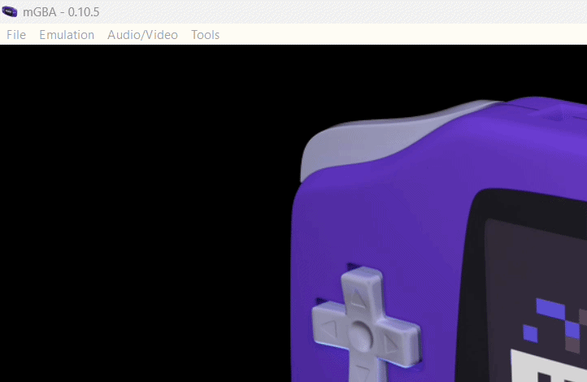
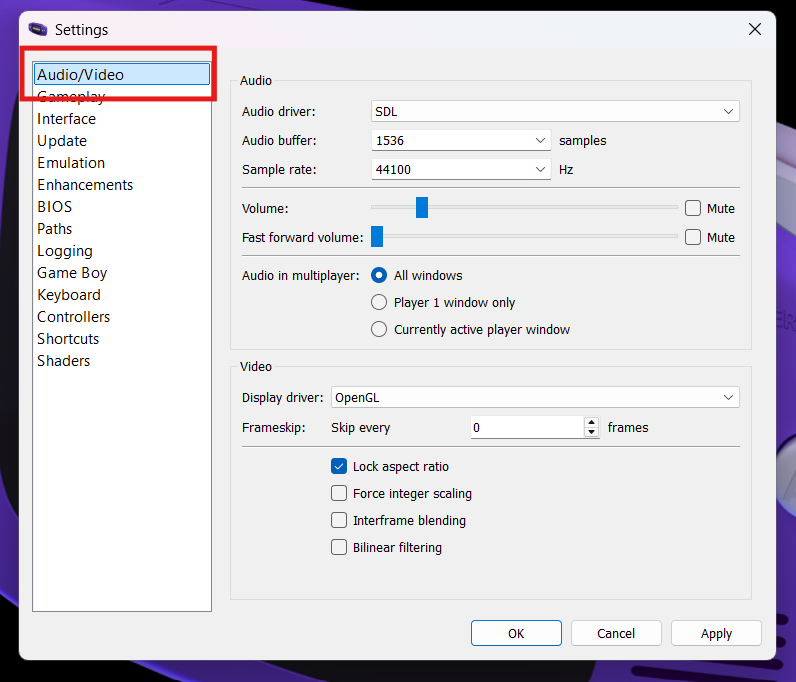
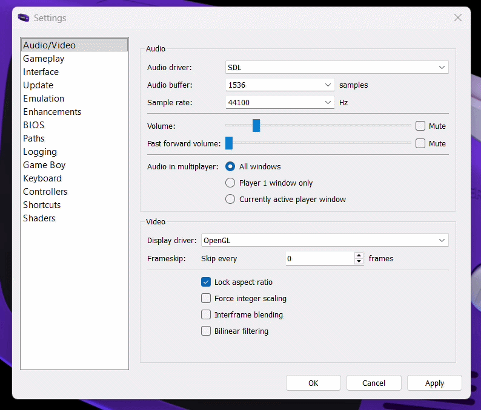
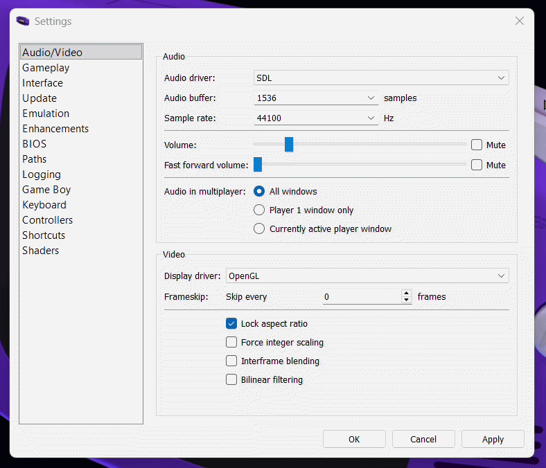
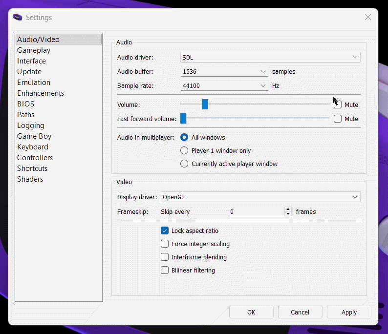
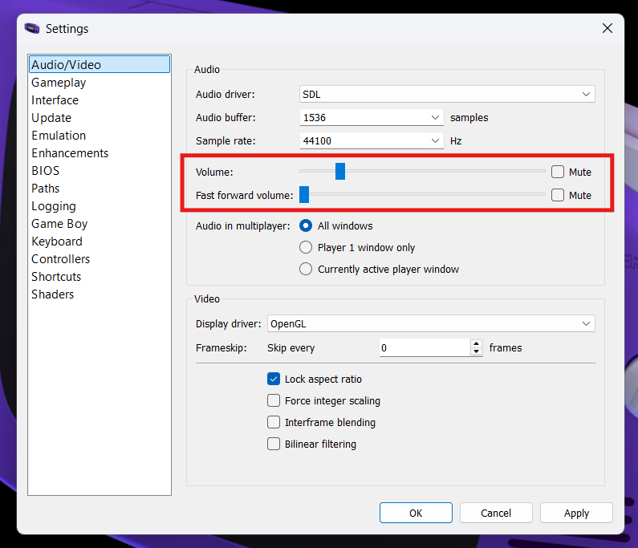
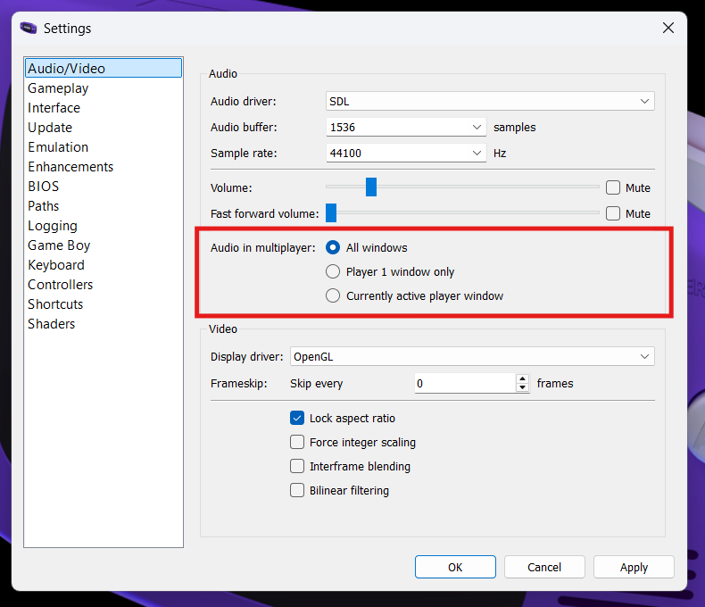

## Overview

The Audio / Video settings in mGBA will allow you to control your preferences as to how your games look and sound on your system. Because mGBA emulates older hardware on modern computers, these settings help ensure that the graphics display clearly, audio plays smoothly and gameplay runs at the correct speed.

!!! Check "Default Settings"

    Most systems will work with the default settings, but spending a few minutes reviewing these options can significantly improve overall performance and comfort.

## Audio / Video Settings

This section will be divided into two parts  (audio settings and video settings), but first we must navigate to the settings menu.

1. Navigate to the audio / video settings:
    
    > Tools > Settings > Audio/Video

    { width="600" }

    { width="600" }

### Audio Settings

2. Select audio driver:

    The audio driver in mGBA affects audio compatibility, latency, and playback stability.

    { width="600" }

    **SDL** is a widely used multimedia library designed for games and emulators. It communicates directly with the operating system’s audio system and is generally the most stable and compatible option.

    ??? Info "Reasons To Choose SDL"
        - Lower audio latency
        - Fewer audio glitches
        - Consistent performance
        - Often recommended

    **Qt Multimedia** is part of the Qt framework used to build mGBA’s graphical interface. It integrates smoothly with the application but may not always perform as consistently as SDL on all systems.

    ??? Info "Reasons To Choose Qt Multimedia"
        - Works well with standard system audio settings
        - May resolve issues if SDL has compatibility problems
        - Simple and reliable fallback
        - No extra configuration

3. Adjust audio buffer:

    Adjusting the buffer size can affect the balance between audio responsiveness and audio stability.

    { width="600" }

    The **lower** the buffer size, the faster sound will respond to what happens in-game but it may cause crackling or popping if your computer can't keep up.

    ??? Info "Reasons To Choose A Lower Buffer Size"
        - More responsive sound
        - Reduced audio latency

    The **higher** the buffer size, the smoother the audio will play, which will help prevent audio glitches but it may add a small delay between game actions and sound.

    ??? Info "Reasons To Choose A Higher Buffer Size"
        - Smoother audio playback
        - More stable performance for slower systems

4. Adjust sample rate:

    Sample rate affects how detailed and clear the audio sounds during gameplay.

    { width="600" }

    The sample rate setting in mGBA determines how many times per second audio is measured and reproduced. A higher sample rate captures more detail in the sound, which can result in clearer and more accurate audio playback.

    ??? Info "Recommended Sample Rate"
        Most modern systems use standard sample rates such as **44100 Hz** or **48000 Hz**, which already provide very good sound quality. In most cases, the default setting will work well and does not need to be changed.

5. Set volume levels:

    Controls how loud the game audio is played.

    { width="600" }

    The volume slider in mGBA controls how loud the game audio is during normal gameplay. You can increase the volume to make sound effects and music louder, or decrease it for quieter playback or when multitasking.

    !!! Check "Fast Forward Volume"
        Fast forward volume controls how loud the audio is when the emulator is running in fast forward mode. Some users prefer lowering this volume because fast-forwarded audio can sound distorted or distracting at higher speeds. Adjusting this setting allows fast forward to remain useful without being too noisy.

6. Multiplayer audio settings:

    Controls how audio is played when multiple games are connected.

    { width="600" }

    The selected multiplayer sound option determines which emulator window(s) will play audio when multiple game instances are running, allowing you to choose whether sound comes from one active window or from all connected windows simultaneously.

!!! Success "Success"
    Your audio settings have been configured and sound should now play smoothly during gameplay. Some settings may require a bit of trial and error to find what works best for your system.

### Video Settings

6. Select display driver:

7. Adjust frameskip:

8. Set video scaling and image processing:

9. Apply settings: