## Overview

This section will go through how to configure controls in mGBA for keyboard and gamepads/controllers.  
This will allow you to personalize how you play games in mGBA,
from editing the keybinds to creating shortcuts for easier inputs.

## Editing keybinds

mGBA is compatible with input via either of the following:

- [Keyboard](#binding-the-keyboard).  
- [Most wired/wireless game controllers](#binding-a-gamepadcontroller).  

!!! Info "Using the keybind editor"

    For both keyboard and controller, a Game Boy Advance gamepad is displayed with text boxes above each button.
    These each hold the current keyboard key, or *"---"* to indicate a lack of one.

### Binding the keyboard

The quickest way to get started with playing games would be to use keyboard controls.  
One can use the defaults, or easily rebind them from the settings.

??? Info "What are the default keybinds?"

    | **Game Boy Button** | **Default Key** |
    | :------------: | :---------: |
    | Up | <kbd>&uarr; Up</kbd> |
    | Right | <kbd>&rarr; Right</kbd> |
    | Down | <kbd>&darr; Down</kbd> |
    | Left | <kbd>&larr; Left</kbd> |
    | A | <kbd>x</kbd> |
    | B | <kbd>z</kbd> |
    | Select | <kbd>&larr; Backspace</kbd> |
    | Start | <kbd>Return</kbd> |
    | L (left shoulder) | <kbd>a</kbd> |
    | R (right shoulder) | <kbd>s</kbd> |

1. **Navigate** to the *Keyboard* tab in mGBA's settings.

    > Tools > Settings > Keyboard 

    { width="90%" }

    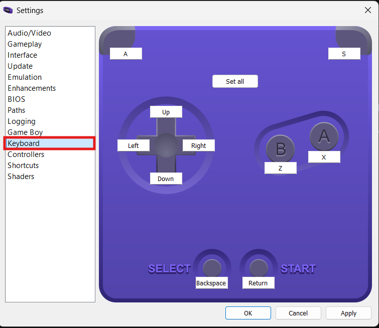{ width="90%" }

2. **Click** on the button that you want to bind.

    To edit the controls for a specific key, **click** on the text box with the old keybind.
    This should highlight the text and prime it for rebinding.

    ??? Info "Setting multiple in a row"

        If you **click** *"Set all"*, mGBA will run through all the buttons in the following sequence:

        > Up > Right > Down > Left > A > B > Select > Start > L (left shoulder) > R (right shoulder)

        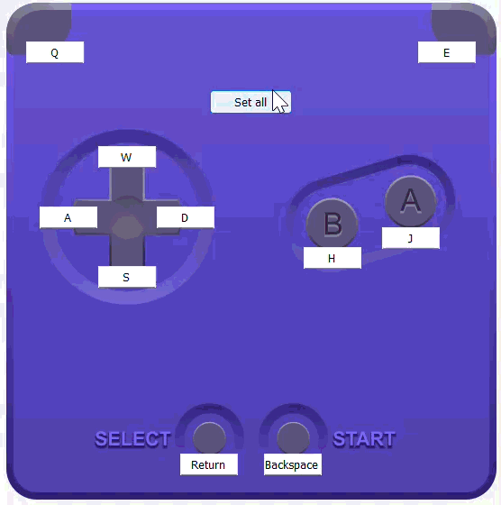{ width="50%" }

3. **Enter** the keyboard key that you want to bind it to.

    The higlighted textbox indicates the currently selected button.

    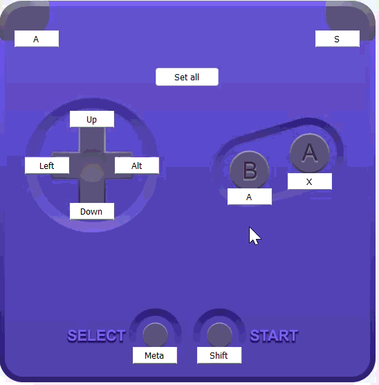{ width="50%" }

4. **Click** *"Apply"*.

    This will save the setting and return you to the home screen.

    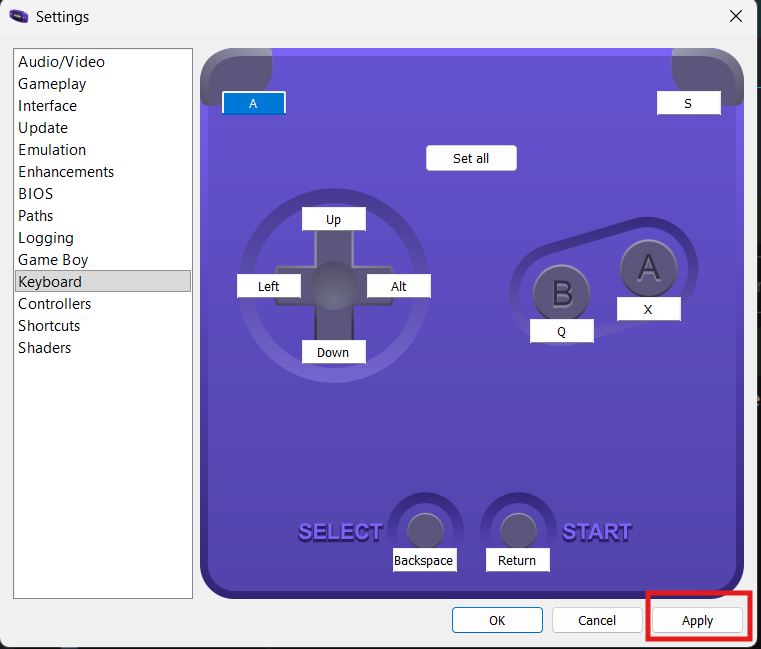{ width="80%" }

### Binding a gamepad/controller

Some users may find game controllers more comfortable and easier to use.
mGBA can detect most modern controllers via a [**USB**](https://en.wikipedia.org/wiki/USB)
or wireless (such as [**Bluetooth**](https://en.wikipedia.org/wiki/Bluetooth)) connection.

1. **Connect** your controller to the computer.  
    
    mGBA will automatically detect any controllers that are connected
    to the system, usually via Bluetooth or a USB cable.

    ??? Note "How do I connect a Bluetooth controller?"

        Different systems and controllers vary in how to get started. 
        Generally, the process follows this pattern:  

        1. **Navigate** to *Bluetooth* in the system settings.
        2. **Activate** Bluetooth and devices search.
        3. **Activate** your controller's pairing mode.
        4. **Choose** your controller's name in the settings.

        For example, [connecting an Xbox controller to PC](https://www.microsoft.com/en-us/windows/learning-center/how-to-connect-xbox-controller-to-pc?msockid=1f0938889d9d649339fd2e559cb065c6).

2. **Navigate** to the *Controllers* tab in mGBA's settings.

    > Tools > Settings > Controllers 

    { width="50%" }

    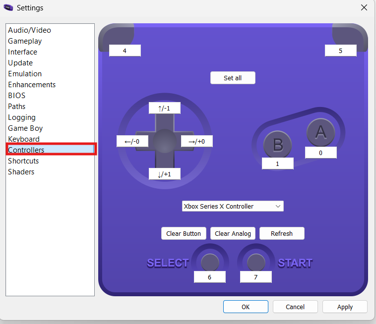{ width="50%" }

3. **Choose** the desired controller from the dropdown.

    From the dropdown in the centre, choose the correct controller
    if you have multiple connected. You may need to click **Refresh**
    if it does not appear right away.  

    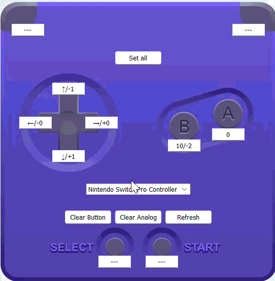{ width=50% }

4. **Click** on the button that you want to bind.

    To edit the controls for a specific key, **click** on the text box with the old keybind using your mouse.
    This should highlight the text and prime it for rebinding.

    ??? Info "Setting multiple in a row"

        If you **click** *"Set all"*, mGBA will run through all the buttons in the following sequence:

        > Up > Right > Down > Left > A > B > Select > Start > L (left shoulder) > R (right shoulder)

        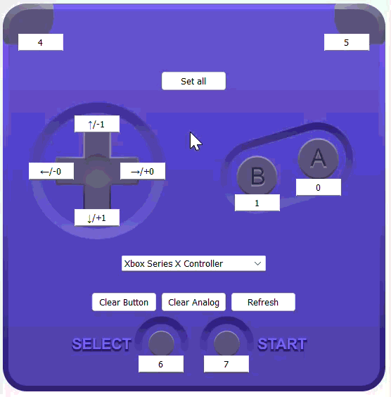{ width="50%" }

5. **Enter** the desired button or motion on the controller.

    The higlighted textbox indicates the currently selected Game Boy button.

    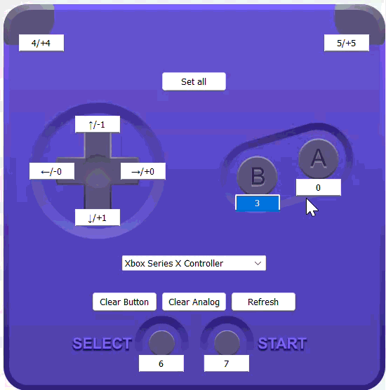{ width="50%" }

    ??? Note "What are these numbers?"

        Unlike in the keyboard settings, the keybinds are written as numeric codes
        that correspond to each button on the controller.  

        Additionally, the joysticks and trigger buttons on many controllers are considered
        [*"analog inputs"*](https://www.gravastar.com/blogs/learn/what-is-analog-input-understanding-analog-input-devices-features).
        These are represented by a `+` or `-` sign before the numeric code and are
        combined with regular keybinds (separated by a slash `/`).

        Look at the following for the codes of common controllers.

        ??? Info "Xbox Series X Controller"

            With an [Xbox Series X Controller](https://www.xbox.com/en-ZA/accessories/controllers/xbox-wireless-controller):

            | **Button** | **Key Code** |
            | :------------: | :---------: |
            | A | 0 |
            | B | 1 |
            | X | 2 |
            | Y | 3 |
            | LB (left shoulder) | 4 |
            | RB (right shoulder) | 5 |
            | LT (left trigger) | /+4 |
            | RT (right trigger) | /+5 |  
            | Select | 6 |
            | Start | 7 |  
            | Left stick | 8 |
            | Left stick | 9 |
            | Home (Xbox) | 10 |
            | Upload | 11 |
            | Up (d-pad) | &uarr; |
            | Right (d-pad) | &rarr; |
            | Down (d-pad) | &darr; |
            | Left (d-pad) | &larr; |  
            | Up (left stick) | /-1 |
            | Right (left stick) | /+0 |
            | Down (left stick) | /+1 |
            | Left (left stick) | /-0 |
            | Up (right stick) | /-3 |
            | Right (right stick) | /+2 |
            | Down (right stick) | /+3 |
            | Left (right stick) | /-2 |  

        ??? Info "Nintendo Switch Pro Controller"

            With a [Nintendo Switch Pro Controller](https://www.nintendo.com/en-ca/store/products/pro-controller/):

            | **Button** | **Key Code** |
            | :------------: | :---------: |
            | A | 0 |
            | B | 1 |
            | X | 2 |
            | Y | 3 |
            | Select | 4 |
            | Home | 5 |
            | Start | 6 |  
            | Left stick | 7 |
            | Left stick | 8 |
            | L (left shoulder) | 9 |
            | R (right shoulder) | 10 |
            | ZL (left trigger) | /+4 |
            | ZR (right trigger) | /+5 |  
            | Up (d-pad) | 11 |
            | Right (d-pad) | 14 |
            | Down (d-pad) | 12 |
            | Left (d-pad) | 13 |  
            | Up (left stick) | /-1 |
            | Right (left stick) | /+0 |
            | Down (left stick) | /+1 |
            | Left (left stick) | /-0 |
            | Up (right stick) | /-3 |
            | Right (right stick) | /+2 |
            | Down (right stick) | /+3 |
            | Left (right stick) | /-2 |  

6. **Click** *"Apply"*.

    This will save the setting and return you to the home screen.

    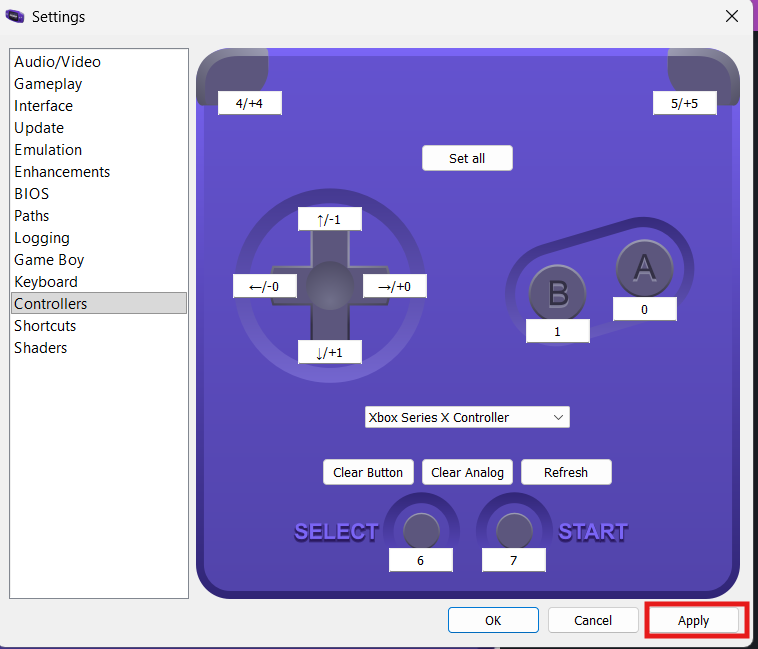{ width="80%" }

!!! Success

    The new keybinds should now be applied when playing a game.

### Defining shortcuts

Shortcuts allow us to interact with mGBA much more conveniently,
especially when playing on controller.

We can set actions like saving the game to a specific button,
so we do not have find the option in the actual menu bar.

This section will outline how to set a shortcut
by mapping the *"Save State"* action to the home button on a controller.

??? Note "What is a save state?"

    *Save states* are snapshots of the exact condition of a game at
    any moment in time.

    This differs from regular *"save data"* which is often keeps only
    information about overall game progress or settings.
    
    Save states are usually handled by the emulator, not the game itself.
    This is useful for recovering from corrupted save data or repeating
    sections in games that do not offer regular saving.

1. **Navigate** to the *Shortcuts* tab in mGBA's settings.

    > Tools > Settings > Shortcuts 

    { width="90%" }

    { width="90%" }

2. **Navigate** to the *Save state* action.

    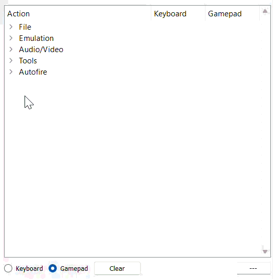{ width="50%" }

    !!! Note "Check!"

        Make sure your controller is connected to the computer and detected by mGBA.

        See [**Binding a gamepad/controller**](#binding-a-gamepadcontroller) for more information.

3. **Activate** binding mode.  

    **Double-click** the space in the *Gamepad* column and *Save state* row.    

    This should prime it for binding, indicated by the:

       - the bottom-right text box being highlighted and  
       - the bottom-left option switching to *"Gamepad"*.

    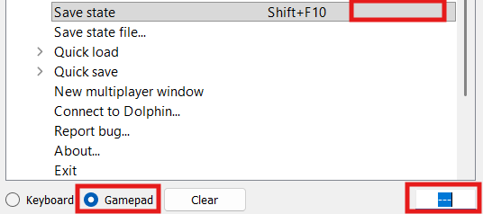{ width="50%" }
    
4. **Enter** the button that you want to bind the action to.

    In our case, we will press the *Xbox Home* button, which corresponds
    to the code `10`

5. **Set** the binding to *Save State*.

    Again, **double-click** the space
    in the *Gamepad* column and *Save state* row.  

    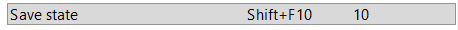{ width="50%" }  

6. **Click** *"Apply"*.

    This will save the setting and return you to the home screen.

    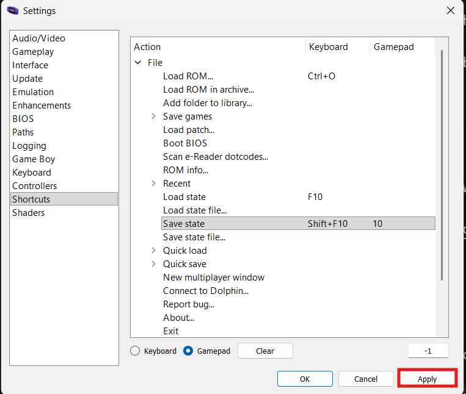{ width="80%" }  

!!! Success

    The shortcut should be activated when the button is pressed in a game.  

    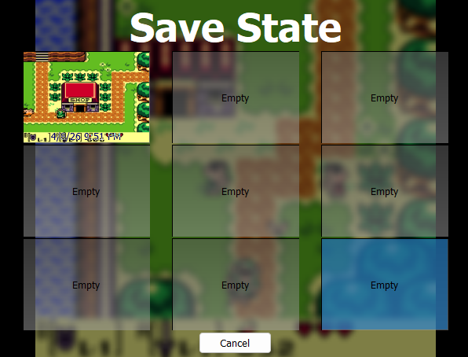{ width="90%" }  

## Conclusion

By finishing this section, you should know how to do the following:  

- [x] Edit the controls for keyboards.  
- [x] Connect a wireless/wired controller.  
- [x] Edit the controls for controllers.  
- [x] Define shortcuts for mGBA actions.

Nice job :cake:, you now know how to set up keyboards and controllers!

Go to the [next section](audiovideo.md) to learn about configuring audio and video settings.
