## Overview

This section will go through how to set up [**mGBA**](https://mgba.io/),
an emulator for the [**Game Boy Advance (GBA)**](https://en.wikipedia.org/wiki/Game_Boy_Advance) console.
It is free, open-source, and easy to install, making it a popular choice for many desktop gamers.

## Installing mGBA

The first step is to install the emulator.  
If you already have it, skip to [Using ROMs](#using-roms).

1. **Visit** the official downloads page at [mgba.io](https://mgba.io/downloads.html).
2. **Download** a version suitable for your operating system.
    For Windows users, you will see the following options:

    - Windows (portable .7z archive)
    - Windows (installer .exe)
    - Windows (64-bit, portable .7z archive) < Recommended
    - Windows (64-bit, installer .exe)

    !!! Info "32-bit vs 64-bit Windows?"

        The number of bits refer to the sizing of how data is stored on your system.  

        Most modern computers are *64-bit*, so you will probably need one of the latter two options.  
        If you have a 32-bit system, choose between the first two.  

        If you are unsure, you can usually find this information in your system settings.

    === "Using the portable version"

        The *".7z archives"* are the *portable* versions. These hold everything compressed as a 7-Zip (similar to a *.zip* file).
        This is the recommended way to install mGBA, as you only need to **extract** the files to get started.
        This allows you to choose where to store it on your computer, and also lets you keep your game files with mGBA.  

        Many newer versions of Windows can extract 7-zip without additional setup,
        but some systems may need a separate extractor from the [**7-zip site**](https://7-zip.link/download.html).  

        !!! Warning

            It is important to store mGBA in a *"common folder"*
            (does not require administrator privileges to access).

            We recommend storing it in a new folder in *Documents* or on your *Desktop*
        
        1. **Click** on the `Windows (64-bit, portable .7z archive)` option to download the files.
        2. **Extract** the files.    

            1. **Right-click** on the archive (`mGBA-xx.xx.xx-winxx.7z`).
            2. **Click** either:

                > Extract all

                or

                > Extract with 7-zip

            3. **Choose** a valid location to put the files.
            4. **Click** *"Extract"*.

            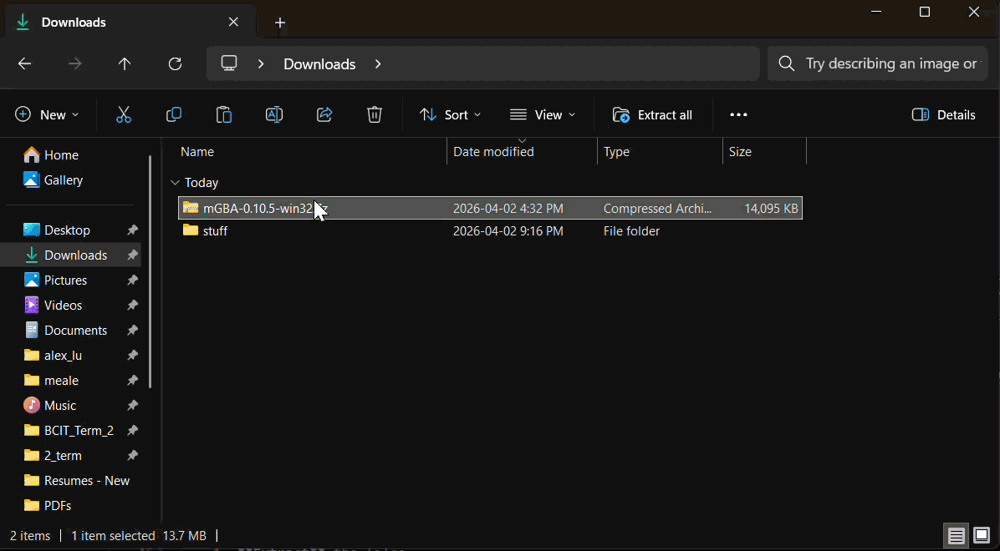{ width=90% }

        ??? Success

            The contents of the extracted folder should look like this.

            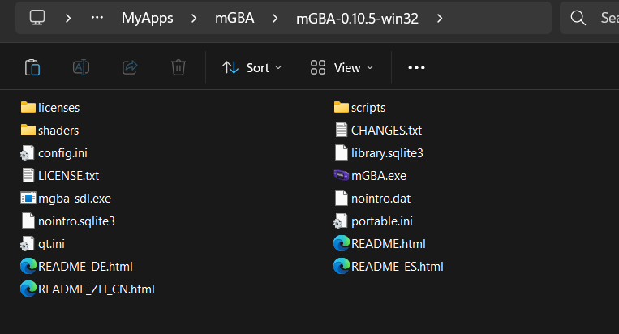{ width=90% }

    === "Using the installer"

        The *"installer .exe"* may be useful for people less comfortable using their file systems.  
        This is an application known as an *"install wizard"*, that will help you install mGBA step-by-step.
        
        1. **Click** on the `Windows (64-bit, installer .exe)` option to download the installer.
        2. **Run** the install wizard (`mGBA-0.10.5-win64-installer.exe`).
        3. **Follow** the prompts on screen.

        ??? Success

            Once installed, the application should exist at the chosen install location.  
            A *Desktop* or *Start Menu* shortcut may also created if this was chosen during the install process.  

3. **Run** mGBA.exe.
    If the portable version was used, this will be in the extracted folder.  

    If the installer was used, this can usually be accessed from one of the following:

       - A *"Desktop"* shortcut.  
       - the Windows *"Start Menu"*.  

        > Windows-Key :fontawesome-brands-windows: > Search "mGBA"

       - The install location, the default being:

        > C:\Program Files\mGBA

!!! Success

    The app should look something like this once opened.

    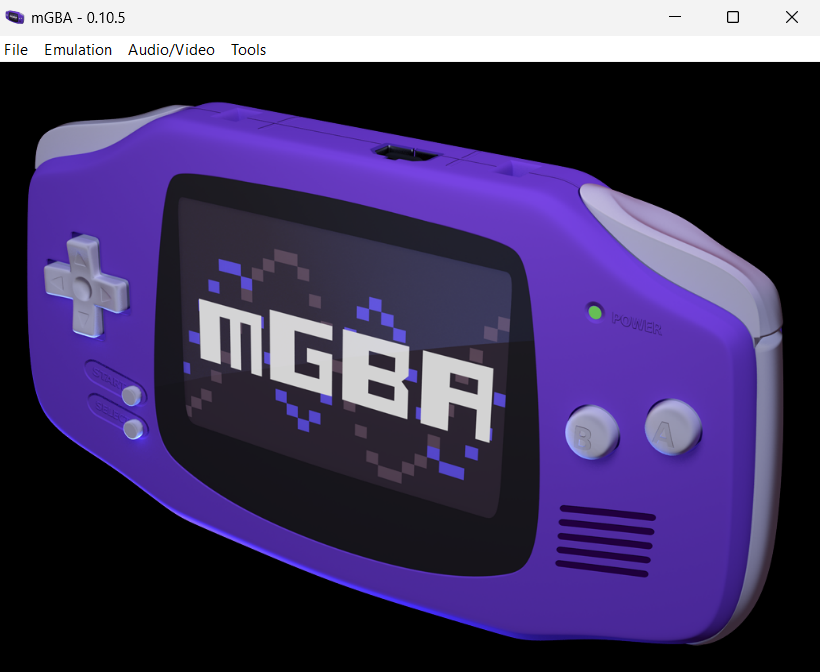{ width=90% }

## Using ROMs

ROM stands for *Read-Only Memory*, which refers
to data that cannot be modified - often stored in
cartridge or disc form. In the context of games
and emulation, it also refers to copies or "dumps" of the game
from physical to digital form.  

mGBA is compatible with the following types of games:  

- [**Game Boy**](https://en.wikipedia.org/wiki/Game_Boy) (*.gb* files).  
- [**Game Boy Color**](https://en.wikipedia.org/wiki/Game_Boy_Color) (*.gbc* files).  
- [**Game Boy Advance**](https://en.wikipedia.org/wiki/Game_Boy_Advance) (*.gba* files).  
- [**Super Game Boy**](https://en.wikipedia.org/wiki/Super_Game_Boy) (*.sgb* files).

The next step is to find a ROM(s) and load it with mGBA.  

1. **Download** a ROM.  

    Getting ROMs can be done in a couple ways:  

      - **Acquire** them online.
      - **Upload** them from a physical copy of the game
      (also known as [ripping ROMs](https://wiki.provenance-emu.com/using-provenance/roms/ripping-roms#cartridge-dumping)).

    ??? Danger "Be careful when downloading ROMs online"

        Downloading ROMs online can be risky and can be illegal depending on where you live!  
        
        Here is a list of things to check if you decide to acquire them this way:  

        - **Avoid** any ROMs that come as *.exe* files, these are likely malicious programs.  
        - **Cross-check** ROM sites with communities such as [r/Roms on Reddit](https://www.reddit.com/r/Roms/wiki/index/).  
        - **Stay away** from any buttons or links that do not match the look of the rest of the site.  

2. **Move** the ROM files to a folder of your choosing.

    In your file explorer, drag the *.gb*, *.gba*, or *.gbc* file
    to a *"common folder"* (does not require administrator privileges to access).
    If the ROM is in a *.zip* folder, there is no need to extract it.  

    If using the portable version, we recommend creating a *"Games"* folder in the same location as *"mGBA.exe"*.

    ??? Warning "Save files are stored in the same folder as the ROM"

        By default, mGBA will also store your game save progress as *".sav"* files in the same folder as the ROM.  

        To change this behaviour, **edit** the *"Path Settings"* in mGBA:

        > Tools > Settings > Interface > Path

3. **Run** mGBA.exe.

4. **Load** the ROM.

    Using the ROM files, there are a couple options for loading these into mGBA.  

    ??? Info "Quick start for previously loaded games"

        Once a game has been opened, you can restart it without directly loading the file again.

        > File > Recent > *Name of your ROM*

    === "Loading individual ROMs"

        One option is to directly start a single game.

        1. **Navigate** to the *"Load ROM..."* option.

            > File > Load ROM...

            This should open the *File Explorer*.

            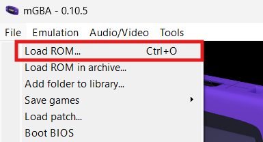{ width=90% }

            !!! Info "You can also use a shortcut for this."
            
                **Enter** <kbd>Ctrl</kbd> + <kbd>O</kbd> on your keyboard to quickly load a ROM.
        
        2. **Choose** a ROM.
            
            In the file explorer, **navigate** to the folder from *step 2* and **click** on the ROM to select it.

            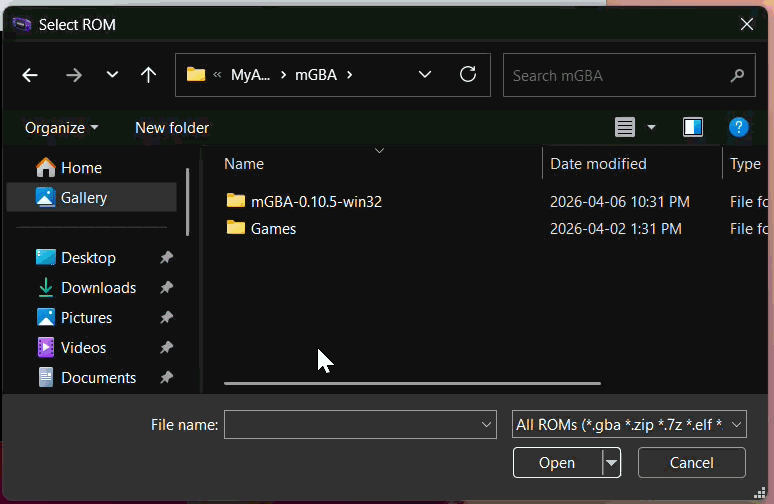{ width=90% }

    === "Loading multiple ROMs"

        You can also pre-load multiple games so you can start them from mGBA's home screen.

        1. **Navigate** to the *Interface* tab in mGBA's settings.

            > Tools > Settings > Interface

            { width="90%" }

            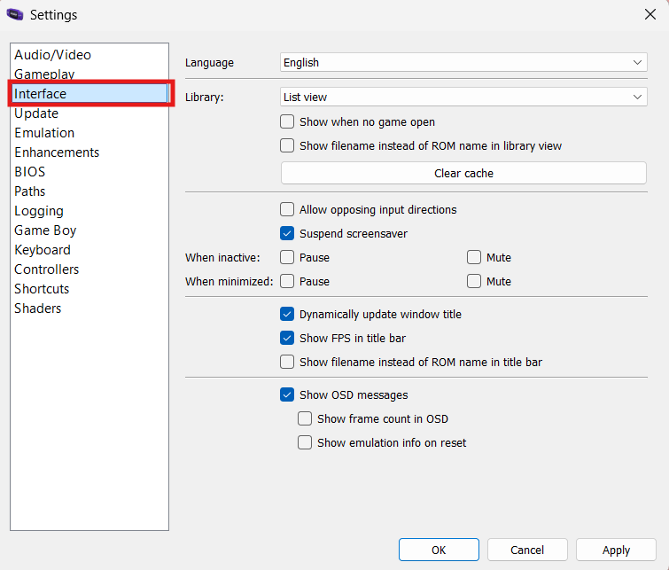{ width="90%" }
    
        2. **Activate** the game library.

            Under the *Library* section, select *"Show when no game open"*
            to change the home screen into a game library. 

            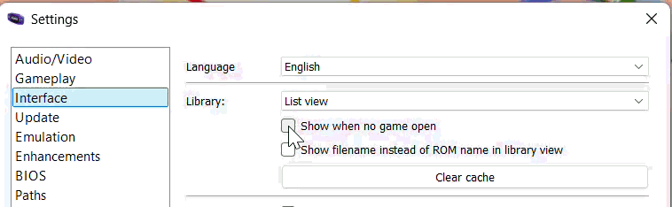{ width="90%" }
        
        3. **Click** *"Apply"*.

            This will save the setting and return you to the home screen.

            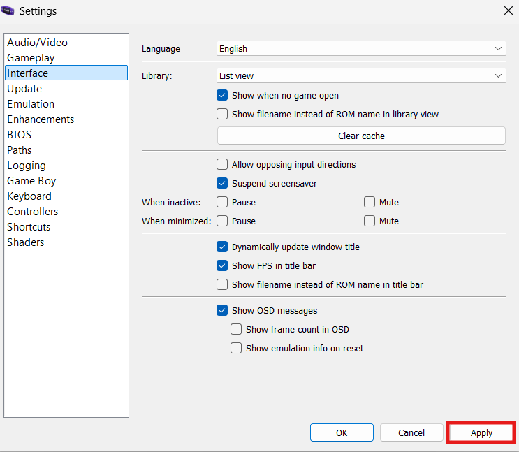{ width="90%" }
        
            ??? Note "Check!"

                Your home screen should now look like this.

                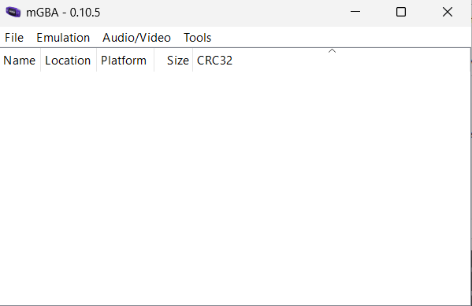{ width="90%" }
        
        4. **Navigate** to the *"Add folder to library..."* option.

            > File > Add folder to library...

            This should open the *File Explorer*.

            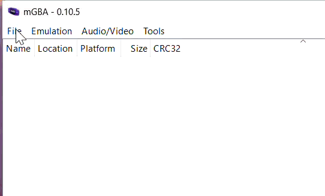{ width=90% }

            !!! Info "You can also use a shortcut for this."
            
                **Enter** <kbd>Ctrl</kbd> + <kbd>O</kbd> on your keyboard to quickly load a ROM.
        
        5. **Choose** a folder with ROMs.
            
            In the file explorer, **navigate** to the folder from *step 2* and **click** *"Open"*.

            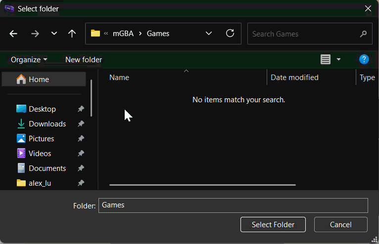{ width=90% }
        
        6. **Choose** a ROM from the mGBA home screen.

            Start a game by clicking on a ROM name in the home screen.

!!! Success

    Your game should now be running.  

    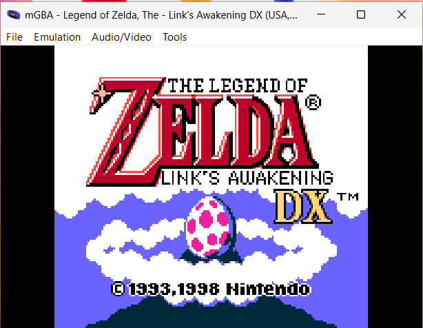{ width=90% }

## Exiting a game

To turn off the game, you can either:

- **close** mGBA, or
- **shutdown** only the game.

This section highlights the second option.

!!! Warning "Remember to save your progress before exiting."

1. **Navigate** to the *Emulation* tab.
2. **Click** *Shutdown*.

    > Emulation > Shutdown

    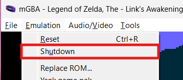{ width=90% }

!!! Success

    This should bring you back to mGBA's home screen, where you can load another game.

## Conclusion

By finishing this section, you should know how to do the following:  

- [x] Install mGBA.  
- [x] Load individual/multiple ROMs.  
- [x] Start a game.  
- [x] Shutdown a game.

Congratulations :tada:, you now know how to set up and play games with mGBA!  

Go to the [next section](configuring-controls.md) to learn about
configuring keyboard and controller controls.
