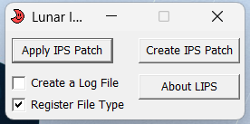
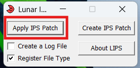
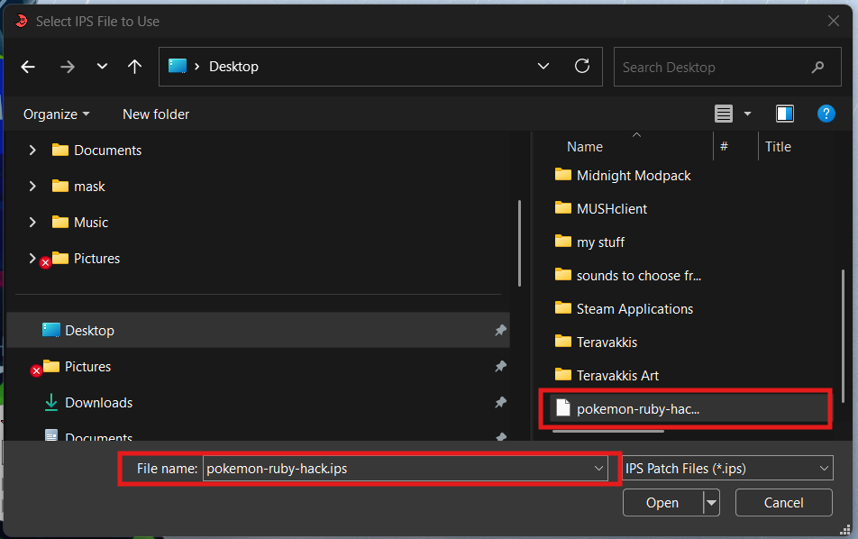
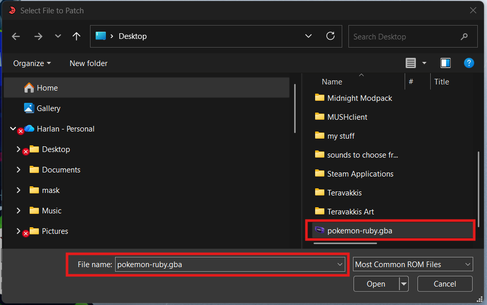
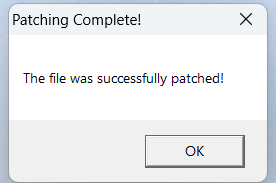

## Overview

This section will walk through the process of patching ROM hacks so they can be played in [**mGBA**](https://mgba.io/). We will go over the basic steps for creating a properly patched ROM that works correctly in the emulator on Windows 11. By the end of this section, you should understand which patch type to use, how to apply it, and how to troubleshoot common issues if a patch does not work as expected.

??? Note "What Are ROM Hacks?"
    [**ROM hacks**](https://www.romhacking.net/hacks/) are fan-made modifications of existing video games that change or expand the original experience. They can include things like new levels, altered gameplay mechanics, visual improvements, bug fixes, difficulty adjustments, or unofficial translations of games that were never released in certain regions. ROM hacks allow players to revisit familiar games in new ways or experience content that was never part of the official release.  

??? Note "What Is Patching?"
    [**Patching**](https://fantasyanime.com/patching#about-patching) is the process of applying a small file containing modifications to an original game ROM in order to create a ROM hack. The patch file only includes the differences between the original game and the modified version, rather than the full game itself. Once the patch is applied, the newly created ROM can be played in an emulator such as [**mGBA**](https://mgba.io/).

!!! Warning "Warning"
    This section is going to assume you have one or many ROM files installed, or at the very least you know how to install and access a ROM file.

## Auto Patching

Auto patching (also referred to as "soft-patching") allows the emulator to apply a patch file automatically when the game is launched, while the original ROM remains unchanged.

??? Info "Why Would I Choose Auto Patching?"
    - You want to keep your original ROM unchanged
    - You may want to easily remove or change the patch later
    - You want a quick and simple setup with minimal file modification

1. **Load** the ROM you want to hack.

    > File > Load ROM

    { width="50%" }

2. **Load** the ROM hack patch.

    > File > Load Patch

    { width="50%" }

!!! Success "Success"
    Super easy right? That is the simplest method to patch your ROM hacks.

## Manual Patching

Manual patching (also referred to as "hard-patching") refers to the process of directly modifying a ROM by applying a patch file, resulting in a permanently updated game file.

??? Info "Why Manual Patching?"
    - It is the most widely supported and commonly used patching method
    - Many ROM hacks specifically expect the ROM to be pre-patched
    - It creates a single ready-to-play file that works in most emulators
    - The process is reliable and easy to follow for beginners

### Installing Lunar IPS

The first step is to install the tool we will use to hack the ROMs. If you already have [**Lunar IPS**](https://www.gamebrew.org/wiki/Lunar_IPS),

1. **Visit** the official downloads page of [Lunar IPS](https://fusoya.eludevisibility.org/lips/).

2. **Download** the WinZip file.

3. **Open** the downloaded archive and locate the Lunar IPS application file.

4. **Extract** the contents of the archive to a convenient location on your computer.

!!! Success "Success"
    You have successfully install Lunar IPS and this is what you should see:

    { width="50%" }

### Using Lunar IPS

1. **Download** the ROM hack patch file.
    Obtain the patch file provided by the hack's creator. This will usually be in **.ips** format.

2. **Download** the correct base ROM.
    Make sure the ROM version matches the one required by the hack. Using the wrong version may cause the patch to fail or the game to crash.

3. **Open** Lunar IPS
    Launch the Lunar IPS application.

4. **Click** 'Apply IPS Patch'.

    { width="50%" }

5. **Open** the .ips hack file.

    { width="50%" }

6. **Open** the ROM file you want to hack.

    { width="50%" }

!!! Success

    { width="50%" }

    All done! now when you load that ROM, it will be loaded pre-hacked.

## Conclusion

By finishing this section, you should know how to do the following:  

- [x] How to auto patch a ROM
- [x] How to manual patch a ROM
- [x] How to install and use Lunar IPS

Congratulations :shamrock:, you now know the basics of ROM hacking!

Go to the [next section](troubleshooting.md) to go over troubleshooting.